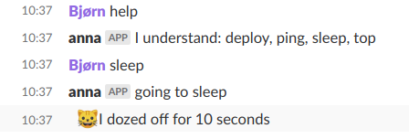

A tiny chatops slack chat bot. Responds to messages in a slack channel by executing predefined custom shell scripts.

## Example



### Using a config.json containing:

```json
{
  "actions": {
    "sleep": {
      "message": "going to sleep",
      "script": "./script/sleep"
    },
    "help": {
      "message": "I understand: deploy, ping, sleep, top"
    },
}
```

## Installation

- Download/clone the repo
- Run `npm install`
- Add a bot at https://my.slack.com/services/new/bot and export the environment variable
  - `export SLACK_CHATOPS_TOKEN=the_token_from_above`
- Configure your actions in [config.json](config/config.json).
- Run `npm start`
